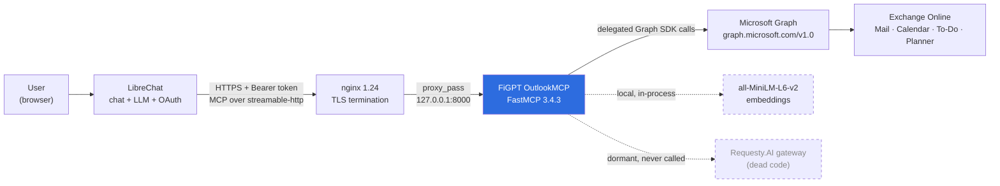
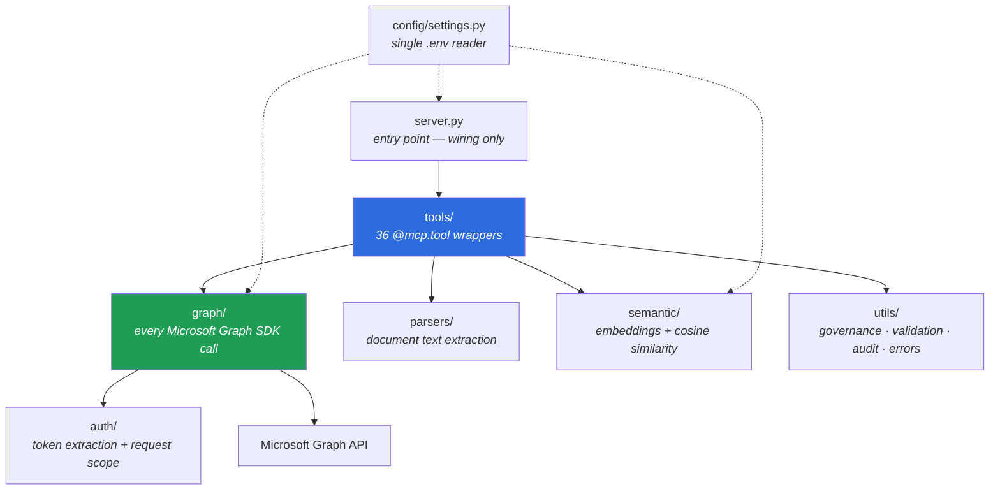
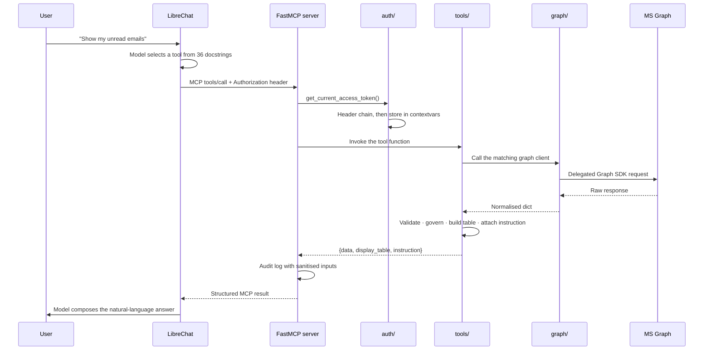
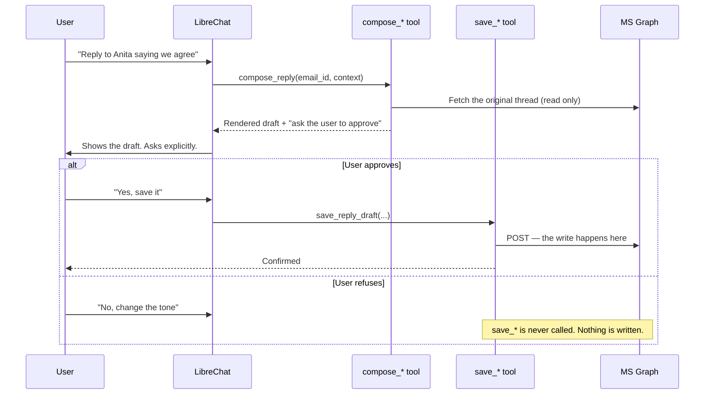

# FiGPT OutlookMCP

**An enterprise Model Context Protocol (MCP) server that gives XYZCONSULT GROUP's LibreChat assistant safe, governed, read-and-write access to a user's Outlook mailbox, calendar and tasks over Microsoft Graph.**


> **Badges are static.** There is no CI pipeline yet. Each badge reflects the last verified
> manual run (2026-07-28). Update them by hand when the underlying fact changes.

---

## Table of Contents

| Section | What you will find |
|---|---|
| [1. Overview](#1-overview) | Objective, background, problem, value, users, assumptions, NFRs |
| [2. Architecture and Design](#2-architecture-and-design) | Diagrams, components, data flow, integrations, tech stack |
| [3. Repository Structure](#3-repository-structure) | Every folder and every file explained |
| [4. Tool Catalogue](#4-tool-catalogue) | All 36 MCP tools and their execution flow |
| [5. Getting Started](#5-getting-started) | Prerequisites and copy-pasteable installation |
| [6. Configuration](#6-configuration) | Every environment variable, plus four known traps |
| [7. Usage Guide](#7-usage-guide) | Commands, code snippets, LibreChat wiring |
| [8. Testing](#8-testing) | Unit suite and live behaviour protocol |
| [9. Runbooks and Operations](#9-runbooks-and-operations) | Start, stop, verify, rotate, recover |
| [10. Security](#10-security) | Token handling, scopes, audit logging, hardening gaps |
| [11. Governance and Contribution](#11-governance-and-contribution) | Layering rules, coding standards, change workflow |
| [12. Troubleshooting](#12-troubleshooting) | Symptom to cause to fix |
| [13. Architecture Decision Records](#13-architecture-decision-records) | ADR-01 to ADR-16 with rationale |
| [14. Roadmap](#14-roadmap) | Open defects and planned work |
| [15. Versioning and Documentation Hygiene](#15-versioning-and-documentation-hygiene) | Keeping this file alive |
| [16. License](#16-license) | Licensing and third-party obligations |

**Quick jumps for complex setups:**
[Install](#52-installation) ·
[Azure app registration](#51-prerequisites) ·
[.env reference](#61-environment-variable-reference) ·
[Config traps](#62-known-configuration-traps) ·
[nginx and proxy](#93-reverse-proxy) ·
[LibreChat entry](#73-librechat-server-entry) ·
[Health check](#91-start-and-verify) ·
[HTTP 421 fix](#12-troubleshooting)

---

## 1. Overview

### 1.1 Short description

FiGPT OutlookMCP is a Python server that exposes 36 Outlook capabilities as MCP tools. LibreChat's language model calls those tools to read mail, search a mailbox semantically, draft replies, check colleague availability, send meeting invites, generate minutes of meeting and track follow-ups. The server itself performs no reasoning — it returns clean structured data plus an instruction string, and LibreChat's model does all the thinking.

### 1.2 Objective

Turn a working prototype into an enterprise-grade, auditable, safe-by-default Outlook automation layer for internal staff.

Three concurrent workstreams:

1. **Defect remediation** — close the findings ledger.
2. **New capability** — scope and build the next feature.
3. **Deployment and hardening** — service management, rate limiting, scope validation, compliance documentation.

### 1.3 Background

Staff spend a large share of the working day inside Outlook. The tasks that consume that time are repetitive and mechanical: finding the one email that matters in a 200-message inbox, writing the same category of reply, extracting action items from a thread, chasing people who never replied, and turning a long meeting thread into minutes.

LibreChat was already deployed internally as the corporate chat assistant. It had no access to mail. Every question about a mailbox had to be answered by the user leaving the chat, opening Outlook, searching by hand and pasting content back in — which also meant pasting sensitive mail into a chat window.

This project closes that gap. It was built over roughly four weeks (28 June to 24 July 2026) in three phases and is now in pilot use.

### 1.4 Problem statement

Four specific problems this project exists to resolve:

1. **No mailbox access from the assistant.** LibreChat could reason but could not see. Users copy-pasted email content manually, which is slow and leaks data into chat logs.
2. **Keyword search is not how people remember email.** Outlook search matches strings. Users remember meaning — "the message about the delayed shipment" — not exact words.
3. **Assistants that write to a mailbox are dangerous by default.** A model that can send mail can send the wrong mail to the wrong people, irreversibly.
4. **Language models invent details.** An assistant summarising an email will confidently fill gaps that were never in the source.

### 1.5 What this project resolves

| Problem | Resolution in this codebase |
|---|---|
| No mailbox access | 36 MCP tools over Microsoft Graph, delegated to the signed-in user only |
| Keyword-only search | `semantic/` — local `all-MiniLM-L6-v2` embeddings with cosine similarity, no vector database, no external API |
| Unsafe writes | **Compose to approve to save** — every write is split into a preview tool and a persist tool, with an explicit human gate between them (see [ADR-02](#13-architecture-decision-records)) |
| Hallucination | `utils/governance.py` injects anti-invention rules into every instruction; `utils/validator.py` inspects output before it returns; `[INFERRED]` and `[UNAVAILABLE]` flags are mandatory |

### 1.6 How it accelerates the working day

- **Triage in one sentence.** "Which of my unread emails are from the finance team this week?" replaces a manual scan of the inbox.
- **Search by meaning.** "Find the thread about the site survey delay" works when the exact words are forgotten.
- **Drafts written in context.** The model reads the original thread and drafts the reply. The user reviews it in chat and approves before anything touches Outlook.
- **Nothing is forgotten.** `track_followups` lists sent mail that never received a reply, filtered by an age threshold.
- **Meetings become minutes.** `generate_mom` turns a whole thread into structured minutes, then saves them as a draft for circulation.
- **Attachments become answers.** PDF, DOCX, PPTX, XLSX, CSV and images are parsed inline — with OCR fallback for scanned documents — so questions about an attachment do not require opening it.
- **Scheduling without the back-and-forth.** `find_availability` reads free/busy for internal colleagues; `compose_invite` renders the invite for approval; `save_invite` sends it.

### 1.7 Primary outcome and business value

- **Time returned to staff.** Mail triage, drafting, follow-up chasing and minute-taking move from manual work into a single conversational request, without the user leaving the assistant.
- **Auditable, governed AI access to corporate mail.** Every tool call is logged with a sanitised input allowlist, no credential is ever written to disk, and no mailbox content ever leaves the corporate boundary to a third-party AI service.

### 1.8 Who uses it

| Audience | How they interact |
|---|---|
| **End users** — internal staff | Through LibreChat chat only. They never see this server |
| **LibreChat platform team** | Own `librechat.yaml`, the OAuth flow and the token forwarded to this server |
| **This project's maintainer** | Owns the code, the tool contracts and the findings ledger |
| **Server and infrastructure team** | Own the host, nginx, TLS certificate and the pending systemd unit |
| **Azure or Entra ID administrators** | Grant Graph API permissions; currently the blocker for Microsoft Planner |
| **Compliance and legal** | Consume the data-flow documentation (pending, see [roadmap](#14-roadmap)) |

### 1.9 Assumptions and dependencies

**Assumptions**

- LibreChat performs the entire OAuth 2.0 flow and forwards a valid delegated Graph access token on every single request.
- One user's token grants access to one user's mailbox. There is no application-level or tenant-wide access anywhere in this codebase.
- The server is stateless. It holds no database and no session store, so it can be restarted at any moment without data loss.
- Requests arrive only through the corporate nginx reverse proxy over TLS.

**Hard dependencies**

| Dependency | Purpose | Failure mode if unavailable |
|---|---|---|
| Microsoft Graph API | Every mail, calendar and task operation | Total loss of function |
| Entra ID app registration | Delegated OAuth and consented scopes | Authentication fails at startup |
| LibreChat | The only supported client; supplies the token and all reasoning | Server is unreachable and useless alone |
| nginx | TLS termination and public routing | No external access |
| `sentence-transformers` model cache | Local semantic embeddings | `semantic_search_emails` fails; all other tools unaffected |
| Tesseract OCR *(optional)* | Scanned-image attachment text | OCR fallback silently unavailable |

### 1.10 Non-functional requirements

| Attribute | Target | Current state |
|---|---|---|
| **Performance** | Read tools respond in under 3 s | Met for direct Graph reads. `semantic_search_emails` re-embeds up to 200 emails per call with **no cache** — it is the slowest path and is a known optimisation target |
| **Reliability** | No unhandled exception reaches the client | `utils/error_handler.py` wraps every tool; `utils/validator.py` inspects every output. 90 unit tests plus a 36-test live behaviour protocol |
| **Availability** | Continuous, restart-resilient | **Not met.** Single instance, started manually. No systemd unit yet, so a host reboot takes the service down and LibreChat must reconnect. This is the largest open operational gap |
| **Scalability** | Pilot scale, single-user concurrency | Stateless and horizontally scalable in principle. **No rate limiting** — nothing prevents an agent loop from throttling the user's Graph token |
| **Data privacy** | No credential or mail body ever persisted | Token lives only in a request-scoped `contextvars` holder, never on disk. Audit logging is **allowlist-based**: bodies, contexts and recipient addresses are never written |
| **Security** | Least privilege, delegated only | Delegated scopes only; no client-credentials flow; no application permissions |
| **Compliance** | GDPR (EU entity) | Audit trail and data minimisation implemented. **The one-page data-flow document for legal is still outstanding** |
| **Observability** | Errors survive the session | `TimedRotatingFileHandler` writes `logs/app.log`; `logs/audit.log` carries JSON-lines tool-call records with daily rotation |
| **Portability** | Linux production, Windows development | Runs on both. Production is Ubuntu with Python 3.12 |

---

## 2. Architecture and Design

### 2.1 System context



**Read this diagram for one fact above all:** the arrow to Requesty.AI is dashed because it is never taken in production. All reasoning happens in LibreChat's own model. See [ADR-01](#13-architecture-decision-records).

### 2.2 Layered design

Layering is strictly observed. A violation is a review blocker.



| Layer | Single responsibility | Never does |
|---|---|---|
| `server.py` | Import tool modules, expose `/health`, start the transport | Business logic, Graph calls |
| `tools/` | Shape output, build markdown tables, emit the `instruction` string | Call Graph directly |
| `graph/` | Every Microsoft Graph SDK call | Format output for display |
| `parsers/` | Bytes to text, per document format | Touch Graph or MCP |
| `semantic/` | Embed and rank | Fetch email |
| `utils/` | Cross-cutting concerns | Contain feature logic |
| `auth/` | Read the token from headers, hold it per request | Persist anything |
| `config/` | Read `.env` exactly once | Anything else |

### 2.3 Request lifecycle

The same nine steps run for every one of the 36 tools.



**Step 4 in detail — the header chain.** Order is empirical. Do not reorder it.

```
Authorization  →  X-<Company>-Authorization  →  X-Auth-Token
```

- `X-<Company>-Authorization` is what LibreChat actually sends in production. The literal header name is hardcoded in both `auth/graph_auth.py` and the platform team's `librechat.yaml` — substitute your real value.
- `X-Auth-Token` is the fallback used by `bin/agent_test.py`, because FastMCP strips `Authorization` on some code paths.
- A raw token is auto-wrapped with `Bearer `. A recognised non-Bearer scheme (`Basic `, `Digest `, `Negotiate `, `NTLM `) is **rejected** rather than wrapped.

### 2.4 The write-path data flow

Every write follows two separate tool calls with a human decision between them. This is the single most important safety property in the system.



**Compose tools never write. Save tools never ask.** `save_invite` is the sharpest case: it creates a real calendar event and irreversibly emails every attendee, so `compose_invite` must state that plainly before the user answers.

### 2.5 Integrations

| Integration | Direction | Protocol | Notes |
|---|---|---|---|
| LibreChat | Inbound | MCP over `streamable-http` | Sole client. Supplies token and all reasoning |
| nginx | Inbound | HTTPS to HTTP | TLS termination, wildcard certificate |
| Microsoft Graph v1.0 | Outbound | HTTPS via `msgraph-sdk` | Mail, Calendar, To-Do, Planner |
| Entra ID | Outbound | OAuth 2.0 | Delegated authorisation only |
| Microsoft To-Do | Outbound | Graph | Working |
| Microsoft Planner | Outbound | Graph | **Blocked** — 403, awaiting admin consent |
| `sentence-transformers` | Local | In-process | Runs on the host. No network call at query time |
| Requesty.AI | Outbound | HTTPS | **Dormant.** Test harness only, never production |

### 2.6 Technology stack

| Layer | Technology | Version | Why |
|---|---|---|---|
| Language | Python | 3.12 (production) | Server standard |
| MCP framework | FastMCP | 3.4.3 | Native MCP with a decorator API |
| Web stack | Starlette / Uvicorn | via FastMCP | ASGI transport |
| Graph access | `msgraph-sdk` | latest | Official typed SDK |
| Auth | `msal` + delegated tokens | latest | Corporate standard |
| Config | `python-dotenv` | latest | Single `.env` source |
| Embeddings | `sentence-transformers` `all-MiniLM-L6-v2` | latest | Small, local, CPU-friendly, no external API |
| Numerics | `numpy` | latest | Cosine similarity |
| PDF | `pymupdf` | latest | **AGPL — see [License](#16-license)** |
| DOCX / PPTX / XLSX | `python-docx`, `python-pptx`, `openpyxl` | latest | Per-format, lightweight |
| OCR | `pytesseract` + `Pillow` | latest | Optional fallback |
| Charts | Mermaid (text output) | n/a | Replaced matplotlib; renders natively in LibreChat |
| Testing | `pytest` 9.1.1 + `pytest-asyncio` 1.4.0 | STRICT mode | Async tool coverage |
| Proxy | nginx | 1.24.0 | TLS and routing |

---

## 3. Repository Structure

```
FiGPT_OutlookMCP/
├── server.py                  # Entry point: wiring, /health, transport start
├── requirements.txt           # Dependencies
├── run_all_test.sh            # Test convenience script (currently broken — see roadmap)
├── .env                       # Live secrets — GITIGNORED, never commit
├── .env.example               # Template — see the config traps section
├── .gitignore                 # Hygiene rules
├── README.md                  # This file
│
├── config/                    # Configuration loading
├── auth/                      # Token extraction and request scope
├── tools/                     # 36 MCP tool definitions
├── graph/                     # All Microsoft Graph SDK calls
├── parsers/                   # Attachment text extraction
├── semantic/                  # Local embeddings and similarity search
├── utils/                     # Governance, validation, audit, logging, errors
├── llm/                       # Requesty.AI wrapper — DORMANT by design
├── tests/                     # pytest suite
├── bin/                       # Developer scripts — not production
├── logs/                      # Runtime logs — GITIGNORED
└── temp_attachments/          # Scratch space for downloads and charts
```

### 3.1 Root files

| File | Responsibility |
|---|---|
| `server.py` | Creates nothing itself — imports the shared `mcp` instance from `tools/mcp_instance.py`, then imports all tool modules **in order** so their `@mcp.tool` decorators fire and register. Defines the `/health` route, which returns status, transport, `tools_registered` and the full tool-name list. Starts the transport. Contains no business logic |
| `requirements.txt` | All dependencies. Currently unbounded `>=` pins with no lockfile — a known risk |
| `run_all_test.sh` | Intended one-command test runner. Contains smart quotes and en-dashes instead of ASCII, so it does not currently execute |
| `.env` | Live configuration and secrets. **Gitignored — verify before every push** |
| `.env.example` | Provisioning template. **Currently ships values that reproduce a known startup bug** — see [traps](#62-known-configuration-traps) |
| `.gitignore` | Must exclude `.env`, `bin/token.json`, all of `logs/`, and `bin/*.txt` |

### 3.2 `config/` — configuration loading

| File | Responsibility |
|---|---|
| `__init__.py` | Package marker |
| `settings.py` | Loads `.env` **once** at import and exposes a single shared `settings` object. `_require_env()` fails loudly at startup for missing critical values; `_optional_env()` supplies defaults. Splits the comma-separated `GRAPH_API_SCOPES` string into a list. Converts boolean strings explicitly, because `bool("false")` is `True` in Python. **No other file reads `os.getenv` directly** |

### 3.3 `auth/` — authentication

| File | Responsibility |
|---|---|
| `__init__.py` | Package marker |
| `graph_auth.py` | `get_current_access_token()` — walks the three-header chain, validates the scheme, auto-wraps raw tokens with `Bearer `, rejects recognised non-Bearer schemes |
| `token_cache.py` | `set_current_token()` / `get_current_token()` / `clear_current_token()`. A `contextvars`-based **request-scoped** holder. Nothing is written to disk and nothing leaks between concurrent requests |

### 3.4 `tools/` — the MCP surface

| File | Tools | Responsibility |
|---|---|---|
| `__init__.py` | — | Package marker |
| `mcp_instance.py` | — | Creates the single shared `FastMCP` instance. Lives in its own module to break the circular import between `server.py` and the tool modules |
| `email_tools.py` | 9 | Listing, reading, searching, paging, exporting, read-status and flagging |
| `draft_tools.py` | 8 | Compose and save for emails, replies and invites, plus availability and draft listing. The whole approval-gate surface |
| `followup_tools.py` | 6 | Follow-up tracking, reply detection, follow-up composition, To-Do and Planner task creation, task listing |
| `folder_tools.py` | 3 | Folder listing, creation, and moving messages |
| `attachment_tools.py` | 3 | Listing, reading and summarising attachments through `parsers/` |
| `mom_tools.py` | 2 | Minutes-of-meeting generation from a thread, plus saving them as a draft. Includes the Markdown-to-HTML converter |
| `calendar_tools.py` | 1 | Calendar event listing over a natural-language date range |
| `chart_tools.py` | 1 | Mermaid chart generation (bar, line, pie) |
| `semantic_tools.py` | 1 | Meaning-based mailbox search |
| `profile_tools.py` | 1 | Signed-in user's profile |
| `task_tools.py` | 1 | Action-item extraction from email text |

> **Ledger correction.** The findings ledger lists `list_tasks` under `tools/task_tools.py`. It is
> actually defined in `tools/followup_tools.py`. `task_tools.py` contains only `extract_tasks`.

### 3.5 `graph/` — Microsoft Graph access

| File | Key functions | Responsibility |
|---|---|---|
| `graph_client_factory.py` | `get_graph_client()`, `get_user_profile()` | Builds an authenticated `GraphServiceClient` from the request-scoped token. **Every other graph module goes through this** |
| `mail_client.py` | `fetch_recent_messages()`, `fetch_message_by_id()` | Message retrieval, search and normalisation to plain dicts |
| `draft_client.py` | `create_draft()`, `create_reply_draft()`, `get_draft_emails()`, `mark_message_read_status()`, `flag_message()`, `get_mail_folders()`, `create_mail_folder()`, `move_message_to_folder()` | Drafts, read state, flags **and folder operations**. Broader than its name suggests |
| `calendar_client.py` | `fetch_calendar_events()`, `_event_to_dict()` | Calendar reads and event normalisation |
| `availability_client.py` | `find_meeting_times()`, `create_calendar_draft_invite()` | Free/busy lookup **and** the `POST /me/events` invite creation |
| `attachment_client.py` | `list_message_attachments()`, `download_attachment()` | Attachment metadata and byte download |
| `task_client.py` | `create_todo_task()`, `create_planner_task()`, `get_todo_tasks()` | Microsoft To-Do and Planner |
| `thread_client.py` | `fetch_email_thread()` | Conversation retrieval by `conversationId` |

### 3.6 `parsers/` — document text extraction

| File | Responsibility |
|---|---|
| `parser_router.py` | `parse_attachment()` — the single dispatch point. Routes by file type, falls back to OCR, returns a uniform result for unsupported types instead of raising |
| `pdf_parser.py` | PDF text via pymupdf |
| `docx_parser.py` | Word documents |
| `pptx_parser.py` | PowerPoint slides |
| `xlsx_parser.py` | Excel and CSV, flattened to text |
| `ocr_fallback.py` | `extract_text_via_ocr()` — pytesseract for images and scanned PDFs. Gated behind `OCR_ENABLED` |

### 3.7 `semantic/` — meaning-based search

| File | Responsibility |
|---|---|
| `embedder.py` | `get_model()` lazily loads and caches `all-MiniLM-L6-v2`. `embed_text()`, `embed_email()`, `embed_emails_batch()` produce vectors |
| `search_engine.py` | `semantic_search()` — cosine similarity ranking with a relevance threshold of **0.25**. In-memory, no vector database. **Re-embeds on every call; caching is a known gap** |

### 3.8 `utils/` — cross-cutting concerns

| File | Responsibility |
|---|---|
| `governance.py` | `get_email_rules()`, `get_mom_rules()`, `get_draft_rules()`, `get_task_rules()`, `get_followup_rules()`. Anti-hallucination text injected into every `instruction`: cite sources, never invent, mark inference with `[INFERRED]`, mark gaps with `[UNAVAILABLE]` |
| `validator.py` | Per-shape validators for email lists, bodies, MOM output, task lists, draft content and calendar events. `append_validation_to_result()` surfaces warnings; errors replace the response entirely |
| `audit_logger.py` | `log_tool_call()` writes JSON-lines to `logs/audit.log` with daily rotation. `_sanitise_inputs()` is **allowlist-based** — anything not explicitly permitted is dropped |
| `error_handler.py` | `format_tool_error()` converts any exception into a user-safe dict, so no traceback ever reaches the chat window |
| `logger.py` | `get_logger()` plus root configuration. Stream handler **and** `TimedRotatingFileHandler` to `logs/app.log`, so tracebacks survive the SSH session |
| `date_utils.py` | `parse_relative_date_range()` turns "this week" or "last month" into a datetime pair. `parse_date_string()` parses explicit dates. Timezone-aware |
| `language_utils.py` | `detect_language()` and `get_language_instruction()`, so replies are drafted in the language of the original |
| `table_utils.py` | `_table_cell()` — collapses whitespace, escapes pipe characters, truncates. **Essential**: a raw `\r\n` or `|` in a preview breaks a Markdown table and mangles the entire chat response |

### 3.9 `llm/` — dormant by design

| File | Responsibility |
|---|---|
| `requesty_client.py` | `generate_summary()` and `_call_requesty_model()` against the Requesty.AI gateway. **Never called in production.** Retained deliberately so `bin/agent_test.py` can exercise tools without LibreChat. See [ADR-01](#13-architecture-decision-records) and [ADR-14](#13-architecture-decision-records) |

### 3.10 `tests/`

Nine test modules, named for what they test rather than by build phase. Tests are **flat functions, never classes** — see [ADR-03](#13-architecture-decision-records).

| File | Covers |
|---|---|
| `test_auth.py` | Header chain, scheme validation, malformed headers |
| `test_mail_tools.py` | Listing, reading, search |
| `test_draft_tools.py` | Compose and save paths, approval gating |
| `test_calendar_tools.py` | Event listing and shape |
| `test_attachment_tools.py` | Attachment listing and reading |
| `test_parsers.py` | Each parser against generated fixture bytes |
| `test_mom_followup.py` | MOM generation, follow-up detection, task creation |
| `test_charts.py` | Real Mermaid output against a `tmp_path` directory |
| `test_guardrails.py` | Governance rule injection and validator behaviour |

### 3.11 `bin/` — developer scripts, not production

| File | Responsibility |
|---|---|
| `get_token.py` | Interactive OAuth flow to obtain a delegated token for manual testing |
| `agent_test.py` | Full agent loop against the server using the Requesty gateway. The only consumer of `llm/` |
| `quick_test.py` | Fast smoke test over a handful of tools |
| `test_mcp_init.py` | MCP handshake verification |
| `diag_list_email.py` | Targeted diagnostic used to isolate the read/unread defect |
| `graph_auth_v1.py` | Superseded auth implementation, retained for reference |
| `token.json`, `*.txt` | **Token and scratch output. Must be gitignored — these have contained live JWTs** |

### 3.12 `logs/` and `temp_attachments/`

| Path | Responsibility |
|---|---|
| `logs/audit.log` | JSON-lines tool-call audit trail, daily rotation. **Contains real user email addresses** |
| `logs/app.log` | Application log with tracebacks, rotating |
| `logs/.gitkeep` | Keeps the directory present in git while its contents are ignored |
| `temp_attachments/` | Downloaded attachment scratch space. **No automatic cleanup routine yet** |
| `temp_attachments/charts/` | Generated `.mmd` chart files |

---

## 4. Tool Catalogue

All 36 registered tools. Verify the live count at any time with `curl -s http://localhost:8000/health`.

**Type key:** **R** read-only · **W** direct write · **C** compose (renders a preview, writes nothing) · **S** save (performs the write, requires prior approval).

### 4.1 Profile — 1 tool

| Tool | Type | Purpose | Execution path |
|---|---|---|---|
| `get_my_profile` | R | Display name, email and job title of the signed-in user | `profile_tools` → `graph_client_factory.get_user_profile` |

### 4.2 Email — 9 tools

| Tool | Type | Purpose | Execution path |
|---|---|---|---|
| `list_emails` | R | Recent inbox messages with a read-status column | `email_tools` → `mail_client` → inbox-scoped |
| `list_emails_paged` | R | Large-volume paged listing | `email_tools` → `mail_client` — ⚠ currently returns Sent Items mixed with Inbox |
| `read_email` | R | Full body and metadata of one message | `email_tools` → `mail_client.fetch_message_by_id` |
| `search_emails` | R | Keyword search | `email_tools` → `mail_client` |
| `search_emails_advanced` | R | Combined sender, keyword and date-range filter | `email_tools` → `mail_client` + `date_utils` |
| `summarise_email` | R | Returns body plus a summarisation instruction. **Performs no summarisation itself** | `email_tools` → `mail_client` → `governance` |
| `export_emails_markdown` | R | Bulk export of up to 200 messages as Markdown | `email_tools` → `mail_client` → `table_utils` |
| `mark_email_read` | W | Set read or unread | `email_tools` → `draft_client.mark_message_read_status` |
| `flag_email` | W | Set, clear or complete a follow-up flag | `email_tools` → `draft_client.flag_message` |

### 4.3 Drafts, replies and invites — 8 tools

| Tool | Type | Purpose | Execution path |
|---|---|---|---|
| `list_draft_emails` | R | List existing drafts | `draft_tools` → `draft_client.get_draft_emails` |
| `compose_email` | C | Render a new email for approval | `draft_tools` → `governance` + `validator` |
| `save_draft_to_outlook` | S | Persist the approved email as a draft | `draft_tools` → `draft_client.create_draft` |
| `compose_reply` | C | Read the original, render a reply for approval | `draft_tools` → `mail_client` → `governance` |
| `save_reply_draft` | S | Persist the approved reply, **threaded** to the original | `draft_tools` → `draft_client.create_reply_draft` |
| `find_availability` | R | Free/busy for attendees. **Internal tenant accounts only** | `draft_tools` → `availability_client.find_meeting_times` |
| `compose_invite` | C | Render the invite and state that saving sends it irreversibly | `draft_tools` → `availability_client` (read) |
| `save_invite` | S | **Creates the event and emails every attendee.** Irreversible | `draft_tools` → `availability_client.create_calendar_draft_invite` → `POST /me/events` |

### 4.4 Folders — 3 tools

| Tool | Type | Purpose | Execution path |
|---|---|---|---|
| `list_folders` | R | All mail folders with unread counts | `folder_tools` → `draft_client.get_mail_folders` |
| `create_folder` | W | Create a folder, optionally nested | `folder_tools` → `draft_client.create_mail_folder` |
| `move_email` | W | Move a message. **Destructive — needs an explicit confirm gate** | `folder_tools` → `draft_client.move_message_to_folder` |

### 4.5 Attachments — 3 tools

| Tool | Type | Purpose | Execution path |
|---|---|---|---|
| `list_attachments` | R | Attachment metadata, without downloading content | `attachment_tools` → `attachment_client` |
| `read_attachment` | R | Download and extract full text | `attachment_tools` → `attachment_client` → `parser_router` |
| `summarise_attachment` | R | Extract text plus a summarisation instruction | `attachment_tools` → `parser_router` → `governance` |

### 4.6 Calendar and availability — 1 tool

| Tool | Type | Purpose | Execution path |
|---|---|---|---|
| `list_calendar_events` | R | Events over a natural-language range such as "this week" | `calendar_tools` → `date_utils` → `calendar_client` |

### 4.7 Follow-ups — 3 tools

| Tool | Type | Purpose | Execution path |
|---|---|---|---|
| `track_followups` | R | Sent mail with no reply beyond a day threshold | `followup_tools` → `mail_client` + `thread_client` |
| `check_email_replied` | R | Whether one specific message received a reply | `followup_tools` → `thread_client.fetch_email_thread` |
| `compose_followup` | C | Render a chase message for approval | `followup_tools` → `mail_client` → `governance` |

### 4.8 Tasks — 4 tools

| Tool | Type | Purpose | Execution path |
|---|---|---|---|
| `extract_tasks` | R | Pull action items out of email text | `task_tools` → `mail_client` → `governance` |
| `add_task_todo` | W | Create a Microsoft To-Do task | `followup_tools` → `task_client.create_todo_task` |
| `add_task_planner` | W | Create a Planner task. **Team-visible.** Currently 403-blocked | `followup_tools` → `task_client.create_planner_task` |
| `list_tasks` | R | List tasks from To-Do or Planner | `followup_tools` → `task_client.get_todo_tasks` |

### 4.9 Minutes of meeting — 2 tools

| Tool | Type | Purpose | Execution path |
|---|---|---|---|
| `generate_mom` | R | Structured minutes from a full thread | `mom_tools` → `thread_client` → `governance` → `validator` |
| `save_mom_as_draft` | S | Convert the approved minutes to HTML and save as a draft | `mom_tools` → `_convert_mom_to_html` → `draft_client.create_draft` |

### 4.10 Semantic search and charts — 2 tools

| Tool | Type | Purpose | Execution path |
|---|---|---|---|
| `semantic_search_emails` | R | Meaning-based search, threshold 0.25 | `semantic_tools` → `mail_client` → `embedder` → `search_engine` |
| `generate_chart` | R | Mermaid bar, line or pie chart | `chart_tools` → writes `.mmd` to `temp_attachments/charts/` |

### 4.11 Standard tool execution flow

Every tool follows the same internal sequence:

1. **Token resolution** — `auth/graph_auth.py` walks the header chain and stores the token in the request scope.
2. **Input validation** — arguments are checked and coerced before any network call.
3. **Graph call** — through the matching `graph/` client, never inline.
4. **Normalisation** — SDK objects become plain dictionaries.
5. **Enrichment** — dates, language and read status are resolved.
6. **Validation** — `utils/validator.py` inspects the shape. Warnings are appended; errors replace the response.
7. **Presentation** — a Markdown table is built through `_table_cell()` so no cell can break the layout.
8. **Governance** — anti-hallucination rules are appended to the `instruction`.
9. **Audit** — the call is logged with a sanitised input allowlist.

The return contract is uniform:

```jsonc
{
  "emails":        [ /* raw structured data for the model to reason over */ ],
  "count":         3,
  "display_table": "| # | From | Subject | ... |",   // ready to render in chat
  "instruction":   "Present the table below. Do not invent senders. ..."
}
```

---

## 5. Getting Started

### 5.1 Prerequisites

**Operating system**

| Environment | Supported |
|---|---|
| Production | Ubuntu Linux (22.04 or later) |
| Development | Windows 10/11 or Linux |

**Runtime and tooling**

| Requirement | Version | Notes |
|---|---|---|
| Python | **3.12** | Production standard. 3.13+ untested |
| pip and venv | bundled | |
| git | any recent | Azure DevOps repository, PAT authentication |
| nginx | 1.24.0 | Production only |
| Tesseract OCR | any | **Optional** — only for scanned attachments |
| Outbound HTTPS | — | To `graph.microsoft.com` and, on first run, the model download host |

**Azure / Entra ID app registration** — obtain these before installing:

- Client ID, client secret and tenant ID.
- Authority URL.
- **Granted delegated scopes:** `Mail.Read`, `Mail.ReadWrite`, `Mail.Send`, `Calendars.Read`, `Calendars.Read.Shared`, `Calendars.ReadWrite`, `User.Read`.
- **Not yet granted:** `Tasks.ReadWrite`, `Tasks.ReadWrite.Shared`, `Group.Read.All`. Without these, Planner returns 403 and only Microsoft To-Do works.

### 5.2 Installation

Run these in order from a shell on the target host.

**Step 1 — Clone the repository**

```bash
git clone <azure-devops-repo-url> /opt/FiGPT_OutlookMCP
cd /opt/FiGPT_OutlookMCP
```

**Step 2 — Create and activate a virtual environment**

```bash
python3.12 -m venv .venv
source .venv/bin/activate          # Linux / macOS
# .venv\Scripts\Activate.ps1       # Windows PowerShell
```

**Step 3 — Install dependencies**

```bash
pip install --upgrade pip
pip install -r requirements.txt
```

**Step 4 — Create the configuration file**

```bash
cp .env.example .env
```

**Step 5 — Correct the template defaults**

> **Do not skip this step.** `.env.example` currently ships values that reproduce a known
> startup failure. See [Known configuration traps](#62-known-configuration-traps).

Open `.env` and confirm all of the following:

```bash
FASTMCP_HOST=0.0.0.0
FASTMCP_PORT=8000
MCP_TRANSPORT=http
GRAPH_API_SCOPES=Mail.Read,Mail.ReadWrite,Mail.Send,Calendars.Read,Calendars.ReadWrite,Calendars.Read.Shared,User.Read
```

Then fill in your Azure values and confirm there is exactly **one** active line per key.

**Step 6 — Verify the configuration loads**

```bash
python -c "from config.settings import settings; print(settings.MCP_SERVER_NAME, settings.MCP_TRANSPORT)"
```

A missing required variable raises `EnvironmentError` here, naming the exact variable.

**Step 7 — Run the test suite**

```bash
pytest -q
```

Expected: **90 passed**.

**Step 8 — Start the server**

```bash
python server.py
```

**Step 9 — Confirm it is healthy**

```bash
curl -s http://localhost:8000/health | python -m json.tool
```

Expected: `"status": "healthy"` and `"tools_registered": 36`.

**Step 10 — Register the server in LibreChat**

Add the entry from [section 7.3](#73-librechat-server-entry) to `librechat.yaml` and restart LibreChat.

---

## 6. Configuration

All configuration lives in `.env` at the project root and is read exactly once by `config/settings.py`.

### 6.1 Environment variable reference

**Azure and Entra ID — all required. The server refuses to start without them.**

| Variable | Required | Default | Purpose |
|---|---|---|---|
| `AZURE_CLIENT_ID` | ✅ | — | App registration client ID |
| `AZURE_CLIENT_SECRET` | ✅ | — | App registration secret |
| `AZURE_TENANT_ID` | ✅ | — | Directory tenant ID |
| `AZURE_AUTHORITY` | ✅ | — | OAuth authority URL |

**Microsoft Graph**

| Variable | Required | Default | Purpose |
|---|---|---|---|
| `GRAPH_API_BASE_URL` | — | `https://graph.microsoft.com/v1.0` | Graph endpoint |
| `GRAPH_API_SCOPES` | — | `Mail.Read,Calendars.Read,User.Read` | Comma-separated. **The default omits every write scope — always set this explicitly** |

**FastMCP server**

| Variable | Required | Default | Purpose |
|---|---|---|---|
| `FASTMCP_HOST` | ✅ in practice | — | **Must be `0.0.0.0`.** The only mechanism that actually binds the interface |
| `FASTMCP_PORT` | ✅ in practice | — | **Must be `8000`** to match the nginx `proxy_pass` |
| `MCP_TRANSPORT` | — | `streamable-http` | **Must be set to `http`.** The default value breaks the proxy |
| `MCP_HOST` | — | `0.0.0.0` | Log display only — see the trap below |
| `MCP_PORT` | — | `8000` | Log display only |
| `MCP_SERVER_NAME` | — | `outlook-ai-agent-mcp` | Name shown in LibreChat |
| `MCP_PUBLIC_URL` | — | empty | Public URL printed in startup logs |

**Requesty.AI — required at startup even though the code path is dormant**

| Variable | Required | Default | Purpose |
|---|---|---|---|
| `REQUESTY_API_KEY` | ✅ | — | **Startup blocker if absent**, despite never being used in production |
| `REQUESTY_BASE_URL` | — | `https://router.requesty.ai/v1` | Production uses the EU router |
| `REQUESTY_PRIMARY_MODEL` | — | `azure/gpt-4.1-nano@swedencentral` | Test harness only |
| `REQUESTY_FALLBACK_MODEL` | — | `mistral/mistral-small-2603` | Test harness only |

**Attachments, semantic search, follow-ups, Planner, charts and logging**

| Variable | Default | Purpose |
|---|---|---|
| `MAX_ATTACHMENT_SIZE_MB` | `25` | Download size ceiling |
| `ATTACHMENT_TEMP_DIR` | `./temp_attachments` | Scratch directory |
| `OCR_ENABLED` | `false` | Enable the OCR fallback |
| `TESSERACT_CMD_PATH` | empty | Explicit Tesseract binary path |
| `SEMANTIC_SEARCH_MODEL` | `all-MiniLM-L6-v2` | Embedding model |
| `SEMANTIC_SEARCH_MAX_EMAILS` | `100` | Messages embedded per query |
| `FOLLOWUP_SCAN_COUNT` | `20` | Messages scanned for follow-ups |
| `FOLLOWUP_DAYS_THRESHOLD` | `3` | Age before a message counts as needing a chase |
| `PLANNER_GROUP_ID` | empty | Planner group |
| `PLANNER_PLAN_ID` | empty | Planner plan |
| `CHARTS_OUTPUT_DIR` | `./temp_attachments/charts` | Chart output |
| `CHARTS_MAX_ITEMS` | `20` | Maximum data points per chart |
| `LOG_LEVEL` | `INFO` | Logging verbosity |
| `LIBRECHAT_DOMAIN` | empty | LibreChat origin |
| `LIBRECHAT_OAUTH_CALLBACK` | empty | OAuth callback URL |

### 6.2 Known configuration traps

Four traps have each cost real debugging time. Read all four before provisioning a new environment.

**Trap 1 — `MCP_TRANSPORT` must be `http`, not `streamable-http`.**
The code default is `streamable-http`, and that value fails behind nginx. Set `MCP_TRANSPORT=http` explicitly. LibreChat's own `type:` field stays `streamable-http` — the two settings are different things and are *supposed* to differ.

**Trap 2 — Only `FASTMCP_HOST` and `FASTMCP_PORT` actually bind.**
FastMCP 3.x removed `host` and `port` from the constructor and rejects `cors_origins` and `transport_security`. Environment variables are the only working route. `MCP_HOST` and `MCP_PORT` remain in `settings.py` and appear in the startup banner, but should be treated as cosmetic. **Symptom when wrong: HTTP 421 Misdirected Request.**

**Trap 3 — `.env.example` currently ships broken defaults.**
It sets `FASTMCP_HOST=127.0.0.1` with `0.0.0.0` commented out — the exact inverse of a working configuration. It also carries duplicate `MCP_TRANSPORT` and `GRAPH_API_SCOPES` keys, where last-wins makes the file work only by accident, and the surviving scope line omits `Mail.Send`. **Provisioning from this file unmodified reproduces the HTTP 421 bug and yields a token that cannot send mail.** A fix is queued.

**Trap 4 — `REQUESTY_API_KEY` is a hard startup requirement.**
It is declared with `_require_env()` in `settings.py`. The server will not start without it even though no production code path calls Requesty. Set any non-empty placeholder value if the gateway is not in use.

---

## 7. Usage Guide

### 7.1 Common commands

```bash
# Activate the environment (run first, every time)
cd /opt/FiGPT_OutlookMCP && source .venv/bin/activate

# Start the server in the foreground
python server.py

# Health check — the fastest confirmation that everything registered
curl -s http://localhost:8000/health | python -m json.tool

# Just the tool count
curl -s http://localhost:8000/health | python -c "import sys,json; print(json.load(sys.stdin)['tools_registered'])"

# Full test suite
pytest -q

# One test file, verbose
pytest tests/test_mail_tools.py -v

# One test by name
pytest -k "test_detects_replied_email" -v

# Tail the application log
tail -f logs/app.log

# Tail the audit trail
tail -f logs/audit.log

# Find which tool ran at a given time
grep "2026-07-28T14:" logs/audit.log*

# Confirm nothing sensitive is about to be committed
git status --short && git check-ignore -v .env logs/app.log bin/token.json
```

### 7.2 Obtaining a token and calling tools directly

Useful when LibreChat is unavailable and you need to isolate whether a fault is in the server or the client.

```bash
# Step 1 — interactive OAuth, writes bin/token.json
python bin/get_token.py

# Step 2 — smoke test a few tools
python bin/quick_test.py

# Step 3 — verify the MCP handshake only
python bin/test_mcp_init.py

# Step 4 — full agent loop (uses the dormant Requesty gateway)
python bin/agent_test.py
```

### 7.3 LibreChat server entry

Add to `librechat.yaml`. Substitute your real header name and domain.

```yaml
mcpServers:
  Fichtner-Outlook:
    type: streamable-http
    url: https://figpt-mcp-outlook.<corp-domain>/mcp
    timeout: 45000
    initTimeout: 150000
    startup: false
    headers:
      X-<Company>-Authorization: "Bearer {{LIBRECHAT_GRAPH_ACCESS_TOKEN}}"
```

| Field | Why this value |
|---|---|
| `type: streamable-http` | What LibreChat's MCP client expects. Deliberately different from the server's `MCP_TRANSPORT=http` |
| `initTimeout: 150000` | The first request loads the embedding model, which is slow. A shorter timeout produces a false connection failure |
| `startup: false` | The server is started manually. Eager connection at LibreChat boot would fail |
| `headers` | The token forwarded on every request. The server never stores it |

### 7.4 Calling a tool over raw MCP

```python
import httpx, asyncio, json

BASE = "https://figpt-mcp-outlook.<corp-domain>/mcp"
TOKEN = "<delegated-graph-access-token>"

async def call_tool(name: str, arguments: dict) -> dict:
    """Minimal MCP call: initialise, then invoke a single tool."""
    headers = {
        "X-Auth-Token": TOKEN,               # fallback header; see the header chain
        "Content-Type": "application/json",
        "Accept": "application/json, text/event-stream",
    }
    async with httpx.AsyncClient(timeout=60) as client:
        await client.post(BASE, headers=headers, json={
            "jsonrpc": "2.0", "id": 1, "method": "initialize",
            "params": {
                "protocolVersion": "2024-11-05",
                "capabilities": {},
                "clientInfo": {"name": "manual-test", "version": "1.0"},
            },
        })
        response = await client.post(BASE, headers=headers, json={
            "jsonrpc": "2.0", "id": 2, "method": "tools/call",
            "params": {"name": name, "arguments": arguments},
        })
        return response.json()

result = asyncio.run(call_tool("list_emails", {"count": 5}))
print(json.dumps(result, indent=2))
```

### 7.5 Adding a new tool

Follow the layering. A tool that calls Graph directly will be rejected in review.

```python
# tools/example_tools.py
from tools.mcp_instance import mcp
from graph.mail_client import fetch_recent_messages   # Graph access via graph/ only
from utils.error_handler import format_tool_error
from utils.governance import get_email_rules
from utils.table_utils import _table_cell
from utils.audit_logger import log_tool_call


@mcp.tool
async def example_tool(count: int = 10) -> dict:
    """
    One-line summary the model reads to decide when this tool applies.

    This docstring IS the tool contract. The model sees nothing else.
    State what the tool returns and, for write tools, state the
    consequence of calling it.

    Args:
        count: How many messages to fetch. Defaults to 10.
    """
    try:
        messages = await fetch_recent_messages(top=count)

        rows = ["| # | From | Subject |", "|---|---|---|"]
        for index, message in enumerate(messages, start=1):
            rows.append(
                f"| {index} "
                f"| {_table_cell(message.get('sender', ''))} "
                f"| {_table_cell(message.get('subject', ''))} |"
            )

        log_tool_call("example_tool", {"count": count})

        # Return dict, and annotate -> dict. A mismatched annotation makes
        # FastMCP reject every response, including the error path.
        return {
            "messages": messages,
            "count": len(messages),
            "display_table": "\n".join(rows),
            "instruction": (
                "Present the table below to the user. "
                + get_email_rules()
            ),
        }

    except Exception as error:
        return format_tool_error("example_tool", error)
```

Then register it in `server.py`:

```python
from tools import example_tools  # noqa: F401
```

**Five rules for any new tool:**

1. The return annotation must match the actual return type exactly. `-> list[dict]` on a function returning a `dict` causes FastMCP to reject **every** response — including errors, which makes a broken tool indistinguishable from a throwing one.
2. Never call Graph directly from `tools/`.
3. Route every table cell through `_table_cell()`.
4. Append governance rules to every `instruction`.
5. Any write tool needs a `compose_` partner and must state its consequence.

---

## 8. Testing

Two independent layers. Both are required — see the warning below.

### 8.1 Unit suite

```bash
pytest -q                            # full suite — expect 90 passed
pytest tests/test_draft_tools.py -v  # one module
pytest -k "invite" -v                # by keyword
pytest --tb=short                    # concise tracebacks
```

- `pytest-asyncio` runs in **STRICT** mode.
- Tests are **flat functions, never classes** — STRICT mode reads `self` as a missing fixture ([ADR-03](#13-architecture-decision-records)).
- Test files are named for what they test, never for a build phase ([ADR-04](#13-architecture-decision-records)).
- `run_all_test.sh` is currently non-executable due to smart quotes and en-dashes. Use `pytest` directly.

### 8.2 Live behaviour protocol

> **A green unit suite is not sufficient evidence.** On 26 July a change passed both an
> AST syntax check and the full suite while carrying a live `KeyError` — the unit tests never
> exercised the table-building loop. Every serious defect found in this project so far has been a
> **behaviour** failure invisible to the unit tests.

`TEST-01_librechat-behaviour-tests.md` defines 36 behaviour tests across 8 rounds, executed manually through LibreChat against a real mailbox. Each test names the specific regression it detects, so a failure is diagnosable without a round trip.

**Round 7 is deliberately gated and its order is mandatory:**

1. Confirm the approval gate renders.
2. Confirm a refusal creates nothing.
3. Send to yourself only.
4. Only then send to a colleague.

If `save_invite` is ever called without a preview being shown first, stop testing immediately and treat it as a defect.

### 8.3 What to run before a push

```bash
pytest -q                                            # 1. unit suite green
python -c "import ast,pathlib; [ast.parse(p.read_text(encoding='utf-8')) for p in pathlib.Path('.').rglob('*.py') if '.venv' not in str(p)]"   # 2. everything parses
curl -s http://localhost:8000/health | grep -o '"tools_registered": [0-9]*'                                                                    # 3. tool count correct
git status --short                                   # 4. nothing unexpected staged
git check-ignore -v .env logs/app.log bin/token.json # 5. secrets excluded
```

---

## 9. Runbooks and Operations

### 9.1 Start and verify

```bash
cd /opt/FiGPT_OutlookMCP
source .venv/bin/activate
python server.py
```

Expected startup banner:

```
INFO | server | All tool modules imported and registered successfully
INFO | server | Starting outlook-ai-agent-mcp on 0.0.0.0:8000
INFO | server | Transport: http
INFO | server | MCP endpoint : https://figpt-mcp-outlook.<corp-domain>/mcp
INFO | server | Health check : https://figpt-mcp-outlook.<corp-domain>/health
INFO | server | Server is running. Press Ctrl+C to stop.
```

Verify from a second shell:

```bash
curl -s http://localhost:8000/health | python -m json.tool
```

### 9.2 Keeping it running

> **Known operational gap.** There is no systemd unit. The server is started by hand, dies with
> the SSH session unless detached, and does not survive a reboot. LibreChat must reconnect after
> every restart. This is the highest-priority infrastructure item.

Interim workaround:

```bash
nohup python server.py > /dev/null 2>&1 &
```

Drafted unit file for the server team:

```ini
[Unit]
Description=FiGPT OutlookMCP Server
After=network-online.target
Wants=network-online.target

[Service]
Type=simple
User=prajapativ
WorkingDirectory=/opt/FiGPT_OutlookMCP
EnvironmentFile=/opt/FiGPT_OutlookMCP/.env
ExecStart=/opt/FiGPT_OutlookMCP/.venv/bin/python server.py
Restart=always
RestartSec=5
StandardOutput=journal
StandardError=journal

[Install]
WantedBy=multi-user.target
```

```bash
sudo systemctl daemon-reload
sudo systemctl enable --now figpt-outlookmcp
sudo systemctl status figpt-outlookmcp
sudo journalctl -u figpt-outlookmcp -f
```

### 9.3 Reverse proxy

- Site config: `/etc/nginx/sites-enabled/figpt-mcpsystems`
- Wildcard TLS certificate
- `proxy_pass http://127.0.0.1:8000`

```bash
sudo nginx -t                    # validate before reloading
sudo systemctl reload nginx
curl -sk https://figpt-mcp-outlook.<corp-domain>/health
```

### 9.4 Log management

| Log | Path | Rotation | Sensitivity |
|---|---|---|---|
| Application | `logs/app.log` | Timed, daily | Tracebacks — may contain identifiers |
| Audit | `logs/audit.log` | Timed, daily | **Real user email addresses** |

```bash
tail -f logs/app.log
grep -h "ERROR" logs/app.log*
grep -h "save_invite" logs/audit.log*        # rotated files included — note the wildcard
ls -la logs/                                 # confirm rotation is happening
```

> **Always search rotated files with a wildcard.** `logs/audit.log` holds today only. A search
> for yesterday's activity against the unrotated name returns empty and reads like "no such
> event occurred" when the record is simply in `logs/audit.log.YYYY-MM-DD`.

### 9.5 Routine maintenance

| Task | Frequency | Command or action |
|---|---|---|
| Confirm rotation is working | Weekly | `ls -la logs/` |
| Clear attachment scratch | Weekly | `rm -rf temp_attachments/*` (keep `.gitkeep`) — **no automatic cleanup exists** |
| Verify tool count | After every deploy | `curl -s localhost:8000/health` |
| Verify secret exclusion | Before every push | `git status --short` |
| Re-run behaviour protocol | After any tool change | `TEST-01_librechat-behaviour-tests.md` |
| Review audit log volume | Monthly | Confirm the 30-day retention is honoured |

---

## 10. Security

### 10.1 Authentication and authorisation model

- **Delegated OAuth 2.0 only.** LibreChat performs the flow; this server never sees credentials.
- **No client-credentials flow and no application permissions anywhere.** A user can reach exactly their own mailbox and nothing else.
- **The token is never persisted.** It is read from headers per request and held in a `contextvars` request scope. Nothing is written to disk, no session store, no cache.
- **Scheme validation is enforced.** Raw tokens are wrapped with `Bearer `; recognised non-Bearer schemes are rejected rather than coerced.

### 10.2 Data protection

| Control | Implementation |
|---|---|
| No credential at rest | `contextvars` request scope only |
| Audit input sanitisation | **Allowlist** in `_sanitise_inputs()` — anything not explicitly permitted is dropped |
| Email bodies never logged | Excluded from the allowlist by design |
| Recipient addresses never logged | Excluded from the allowlist by design |
| No third-party AI processing | No mailbox content leaves the corporate boundary ([ADR-12](#13-architecture-decision-records)) |
| Local embeddings | `all-MiniLM-L6-v2` runs in-process; no query or content is sent anywhere |
| TLS | Terminated at nginx with a wildcard certificate |

### 10.3 Repository hygiene

**Must never be committed:**

- `.env` — live Azure client secret
- `bin/token.json` — live delegated access token
- `bin/*.txt` — scratch output that has previously contained a full Graph JWT
- `logs/*` — including every rotated `audit.log.YYYY-MM-DD`, all of which carry real user email addresses

Verify with:

```bash
git check-ignore -v .env bin/token.json logs/app.log logs/audit.log.2026-07-28
git ls-files logs/ bin/
```

> `git check-ignore` prints the matching rule for each ignored path. **Silence for a path means
> it is not ignored.** And note that widening `.gitignore` does nothing for a file already
> tracked — check `git ls-files` first, then use `git rm --cached` where needed.

### 10.4 Known hardening gaps

Tracked honestly rather than quietly. All are open.

| Gap | Risk | Planned mitigation |
|---|---|---|
| **No rate limiting** | An agent loop can hammer Graph until the user's token is throttled | ~20 lines of FastMCP middleware in `server.py`. Needs a per-token versus per-server decision first |
| **No scope validation** | A write against a read-only token fails with a cryptic 403 instead of a clear message | Pre-flight check in `auth/graph_auth.py`. Now more valuable than ever, because `save_invite` sends real mail to real people |
| **No temp-file cleanup** | Downloaded attachments persist on disk indefinitely | `finally: cleanup_temp_file(...)` in the attachment path |
| **Partial HITL coverage** | `move_email` (destructive) and `add_task_planner` (team-visible) have no explicit confirm gate | Add gates to their instruction strings |
| **Unpinned dependencies** | `fastmcp>=2.0.0` spans the 2→3 major that caused the HTTP 421 incident | Upper bounds plus a lockfile |
| **Missing `ServiceException` handling** | Some Graph service errors are not mapped to friendly messages | Add a clause to `utils/error_handler.py` |
| **Compliance documentation** | GDPR data-flow document not written | One-page document for legal |

### 10.5 Reporting a security issue

Raise it directly with the project maintainer and the XYZCONSULT GROUP security contact. **Do not** open a public work item containing token values, mailbox content or log excerpts with real email addresses.

---

## 11. Governance and Contribution

### 11.1 Non-negotiable rules

1. **Tools never call an LLM.** They return data plus an `instruction`. LibreChat's model reasons. ([ADR-01](#13-architecture-decision-records))
2. **No external AI dependency.** No hosted embeddings, no moderation APIs, no third-party model calls. ([ADR-12](#13-architecture-decision-records))
3. **Every write passes a human gate.** Compose renders, the user approves, save persists. ([ADR-02](#13-architecture-decision-records))
4. **Layering is absolute.** `tools/` never calls Graph directly.
5. **Return annotations must be exact.** A mismatch makes FastMCP reject every response.
6. **The company name is a placeholder in code and documentation.** Real values are substituted at deployment. Hostnames keep the real domain, because configuration accuracy requires it. ([ADR-09](#13-architecture-decision-records), [ADR-13](#13-architecture-decision-records))

### 11.2 Coding standards

- Every module opens with a docstring: what it is, why it exists, design notes.
- Comment the **why**, not the what. Especially for empirical decisions such as the header-chain order.
- Tool docstrings are the model-facing contract — precise, and explicit about consequences.
- Flat test functions only.
- Test files named for what they test.
- All Graph calls are `async`.
- Errors return through `format_tool_error()`; a traceback must never reach the chat window.

### 11.3 Change workflow

1. Read `PROJECT_STATE.md` first — it is the hand-off document between sessions.
2. Check the findings ledger before starting; the defect may already be recorded.
3. Make **one** change at a time and verify it before the next. ([ADR-16](#13-architecture-decision-records))
4. Run `pytest -q` — expect 90 passing.
5. Run the relevant rounds of the behaviour protocol. A green unit suite alone is not evidence.
6. Verify the tool count via `/health` if you added or removed a tool.
7. Confirm secret exclusion before pushing.
8. Update `PROJECT_STATE.md` and this README in the same change.

### 11.4 Delivery model

There is currently **no direct repository access from the maintainer's authoring environment**. Changes are delivered as documentation and applied by hand:

- **A small fix** — a paste-ready `Find:` / `Replace with:` block.
- **Several fixes** — one structured `.md` file with a checklist and per-block verification.
- **Always** step-by-step, always explained, always verifiable.

Live state is confirmed by asking for file contents or terminal output, never assumed. ([ADR-11](#13-architecture-decision-records))

---

## 12. Troubleshooting

| Symptom | Likely cause | Fix |
|---|---|---|
| **HTTP 421 Misdirected Request** | `FASTMCP_HOST` is `127.0.0.1`, or unset | Set `FASTMCP_HOST=0.0.0.0` and `FASTMCP_PORT=8000` in `.env`. Constructor arguments do not work in FastMCP 3.x |
| **LibreChat cannot connect** | `MCP_TRANSPORT` is `streamable-http` | Set `MCP_TRANSPORT=http` in `.env`. LibreChat's own `type:` stays `streamable-http` |
| **`EnvironmentError: Missing required environment variable`** | A `_require_env()` value is absent | The message names the variable. Note `REQUESTY_API_KEY` is required even when unused |
| **Server exits immediately with an import error** | A syntax error or missing dependency in `tools/` | The log names the file. Re-run `pip install -r requirements.txt` |
| **"outputSchema defined but no structured output returned"** | A tool's return annotation does not match its actual return type | Correct the annotation. `-> dict` for a dict. This rejects the error path too, which makes broken and throwing tools look identical |
| **A tool returns nothing and the model silently uses another** | Same schema-mismatch cause as above | Check `/health` first, then the annotation |
| **Markdown table renders mangled or split across rows** | A raw `\r\n` or `\|` reached a table cell | Route every cell through `_table_cell()` |
| **Planner returns 403** | `Tasks.ReadWrite`, `Tasks.ReadWrite.Shared` and `Group.Read.All` are not consented | Azure administrator action. To-Do continues to work |
| **`find_availability` returns nothing for a valid person** | The address is outside the tenant | Expected Graph behaviour, not a defect. Free/busy is internal-only |
| **No invite email arrives when inviting only yourself** | You are the organiser | Expected Graph behaviour. Organisers are not sent invitations; the event is written straight to the calendar |
| **First request after startup times out** | The embedding model is loading | Raise `initTimeout` in `librechat.yaml`. 150000 ms is the working value |
| **Tracebacks vanish after the SSH session ends** | Reading terminal scrollback instead of the file | Read `logs/app.log`. It persists and rotates |
| **A log search returns empty for a past event** | The record is in a rotated file | Search with a wildcard: `grep -h "pattern" logs/audit.log*` |
| **Server dies when the terminal closes** | No systemd unit exists | Use `nohup`, or install the drafted unit file |
| **Reply drafts look detached in the Drafts folder** | Outlook lists reply drafts flat, outside conversation view | If sending the draft manually nests it correctly, the `conversationId` is right and this is a display artefact. Confirm which tool ran via the audit log before changing any code |

---

## 13. Architecture Decision Records

Every significant decision, with the reason it was made. Reversing one of these should require a new ADR, not a quiet edit.

| ADR | Date | Decision | Rationale |
|---|---|---|---|
| **ADR-01** | 2026-07-07 | **Tools never call an LLM.** They return data plus an `instruction`; LibreChat's model reasons | LibreChat's models are better, and it avoids paying for two model calls per request |
| **ADR-02** | 2026-07-12 | **Compose to approve to save** for every write | Four designs were compared. Only this one stopped raw context and instruction text bleeding into the Outlook draft body — and it provides a natural human gate |
| **ADR-03** | 2026-07-17 | Tests are flat functions, never classes | `pytest-asyncio` STRICT mode reads `self` as a missing fixture. A `pytestmark` workaround exists but was rejected as over-complicated |
| **ADR-04** | 2026-07-15 | Test files are named for what they test, never by phase | Phase numbers stop meaning anything once phases merge |
| **ADR-05** | 2026-07-22 | **Microsoft Teams gets its own MCP server**, not tools inside this one | 36 tools is already at the edge of reliable model tool selection (20–30 is the practical limit); mature community Teams servers exist; separate servers fail independently |
| **ADR-06** | 2026-06-29 | MongoDB deferred; the server stays stateless | Not needed until the semantic corpus outgrows in-memory search |
| **ADR-07** | 2026-06-29 | No Docker work | The platform team owns LibreChat infrastructure. This project ships an MCP server behind their proxy |
| **ADR-08** | 2026-06-30 | Per-format parser libraries over an all-in-one | Heavy ML dependency trees are not justified for a single-user pilot. **Flag: pymupdf is AGPL** |
| **ADR-09** | 2026-07-02 | The company name is a placeholder in generated code and documentation | Standing instruction. Hostnames keep the real domain because configuration accuracy requires it |
| **ADR-10** | 2026-07-25 | State is tracked in `PROJECT_STATE.md` and a memory directory, not chat history | Chat transcripts do not survive closing a session. Files do |
| **ADR-11** | 2026-07-25 | **Delivery format.** No direct repository access — small fix as a patch block, several fixes as one `.md` file. Ask for live state, never guess | Every change is applied by hand by a single developer. Guessing at live state wastes a round trip and risks a wrong patch |
| **ADR-12** | 2026-07-25 | **No external AI dependency anywhere** | Corporate restriction on the secure host. Also the reason guardrails are code and prompt rules only |
| **ADR-13** | 2026-07-25 | The employer's name is a placeholder, substituted manually. The `X-<Company>-*` headers are **not** renamed | They are hardcoded in the platform team's `librechat.yaml` too. Renaming would break production |
| **ADR-14** | 2026-07-25 | **Requesty.AI code stays in place, dormant and untouched** | The `bin/agent_test.py` harness remains useful for exercising tools without LibreChat |
| **ADR-15** | 2026-07-25 | **Meeting invites get the approval gate** — split into `compose_invite` and `save_invite` | Invites are *supposed* to send. But this was the only write path with no review step, unlike every other one under ADR-02. Fixing the invite crash without this split would have produced a tool that emails external attendees while claiming to save a draft |
| **ADR-16** | 2026-07-25 | **Deliver one task at a time**, verify before the next | A five-part change was delivered at once and never applied. Single-step delivery is what actually lands |

---

## 14. Roadmap

Priority order. Current status: 34 of 36 behaviour tests passing; every High-severity defect except repository hygiene is closed and behaviour-verified.

### 14.1 Immediate

| Item | Severity | Description |
|---|---|---|
| Repository hygiene | **High** | `.gitignore` matches only the exact path `logs/audit.log`. It does not cover `logs/app.log` or any rotated `audit.log.YYYY-MM-DD`, all of which carry real user email addresses. **The only defect that worsens with time** — every push bakes it further into history |
| Reply-draft threading | Medium | Reply drafts appear detached in the Drafts folder, yet sending one manually nests it correctly. Settle with a single audit-log check before writing any code |

### 14.2 Next — planned `FIX-04`

| Item | Severity | Description |
|---|---|---|
| Planner-to-To-Do substitution | Medium | Asked explicitly for Planner, the model silently answered with To-Do data. The unavailability message is correct; the **fallback** is the defect. When a requested source is unavailable, say so and stop — offer the alternative, never substitute it |
| Paged listing folder scope | Medium | `list_emails_paged` returns Sent Items mixed with Inbox. `list_emails` is correctly scoped, so the two tools disagree on what "my emails" means |
| `.env.example` correction | Medium | Inverted host default plus duplicate keys — see [Trap 3](#62-known-configuration-traps) |
| Dependency pinning | Medium | Upper bounds and a lockfile. Drop the now-unused `matplotlib` |
| Chart `x_label` | Low | Accepted and documented but never emitted. The bar branch itself is confirmed working |
| `run_all_test.sh` | Low | Smart quotes and en-dashes make it non-executable |
| `server.py` cleanup | Low | Unused imports, an unapplied CORS placeholder, and a docstring still claiming 9 tools |
| Dead code removal | Low | A parked Requesty string block, a duplicate import, unused chart constants, and a `_needs_followup` check against a key that is never set |
| Audit allowlist review | Low | `title` is allowlisted while `subject` is excluded as sensitive — but task titles are often derived from the subject |
| Deprecated `datetime.utcnow()` | Low | Replace with `datetime.now(timezone.utc)` |

### 14.3 Hardening backlog

Rate limiting and scope validation first — see [Known hardening gaps](#104-known-hardening-gaps). Then temp-file cleanup, the remaining HITL gates, `ServiceException` handling, and the GDPR data-flow document.

### 14.4 Infrastructure

- **systemd unit** — the last piece of the deployment story. Persistent logging already exists.

### 14.5 Externally blocked

| Blocker | Owner | Status |
|---|---|---|
| Planner 403 — needs `Tasks.ReadWrite`, `Tasks.ReadWrite.Shared`, `Group.Read.All` | Azure administrator | Open |
| `find_availability` is tenant-internal only | — | Graph behaviour, not a defect. Documented |
| No systemd service | Server team | Open |

### 14.6 New capability

The second workstream is **not yet scoped**. With the defect list this short, scoping it is close to becoming the main work.

---

## 15. Versioning and Documentation Hygiene

### 15.1 Documentation set

| Document | Purpose | Update trigger |
|---|---|---|
| `README.md` | This file. Entry point for every audience | Any structural, tool or configuration change |
| `PROJECT_STATE.md` | **Living hand-off document.** Read it first in any session | Every working session |
| `AUDIT-*.md` | Full codebase reviews | New audit |
| `FIX-*.md` | Paste-ready remediation blocks | New remediation batch |
| `TEST-01_*.md` | Live behaviour protocol | New tool or changed behaviour |

### 15.2 Versioning

- **Document version:** 1.0.0 — 2026-07-31.
- Semantic versioning: **major** for a breaking tool-contract change, **minor** for a new tool, **patch** for a fix.
- The tool count in the badge and in section 4 must match `/health`. They are the fastest way to spot a stale document.

### 15.3 Hygiene rules

1. **Update documentation in the same change as the code.** Not afterwards.
2. **Never state an unverified fact as verified.** This project uses explicit markers — verified, confirmed, needs checking — because a stale snapshot has already caused a wasted fix round.
3. **Record the reason, not just the decision.** Every ADR carries its rationale, which is what makes it safe to revisit later.
4. **When a fix lands, close its ledger row and say what proved it.**
5. **Re-verify before every release:** tool count, test count, granted scopes, transport values.

### 15.4 Last verified

| Fact | Value | Verified |
|---|---|---|
| Registered tools | 36 | 2026-07-28, live `/health` |
| Unit tests | 90 passing | 2026-07-28 |
| Behaviour tests | 34 of 36 passing | 2026-07-28 |
| FastMCP | 3.4.3 | 2026-07-28 |
| Python | 3.12 | 2026-07-28 |
| `Calendars.ReadWrite` | Granted | 2026-07-28, proven by a real `POST /me/events` |
| Planner access | 403, blocked | 2026-07-28 |

---

## 16. License

**Proprietary and confidential. © 2026 XYZCONSULT GROUP. All rights reserved.**

Internal use only. Not for redistribution outside XYZCONSULT GROUP.

> **Action required.** The repository does not currently contain a `LICENSE` file. Add one that
> states the above explicitly — an unlicensed internal repository creates ambiguity for anyone
> who inherits it.

### 16.1 Third-party obligations

Dependencies are licensed under their own terms. One requires attention before production rollout:

| Package | License | Consideration |
|---|---|---|
| **`pymupdf`** | **AGPL-3.0** | ⚠ **Open compliance item.** AGPL carries network-use obligations. Requires an open-source compliance review, a commercial licence, or replacement with a permissively licensed PDF parser |
| `fastmcp` | Apache-2.0 | No obligation |
| `msgraph-sdk`, `msal` | MIT | No obligation |
| `sentence-transformers` | Apache-2.0 | No obligation |
| `python-docx`, `python-pptx` | MIT | No obligation |
| `openpyxl` | MIT | No obligation |
| `pytesseract`, `Pillow` | Apache-2.0 / HPND | No obligation |

The `all-MiniLM-L6-v2` model is Apache-2.0 and runs entirely locally. No data is transmitted to any model host.

---

<div align="center">

**FiGPT OutlookMCP** · XYZCONSULT GROUP · Document v1.0.0 · 2026-07-31

Start with [`PROJECT_STATE.md`](PROJECT_STATE.md) for current status and the open findings ledger.

</div>
